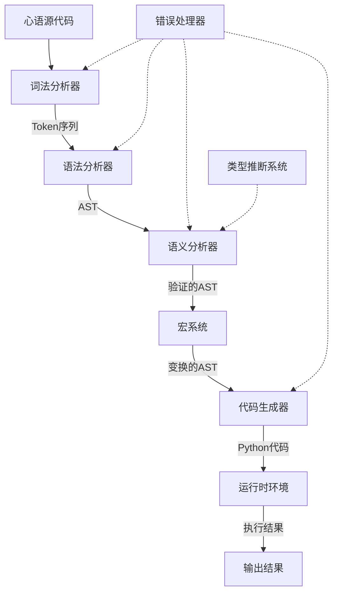
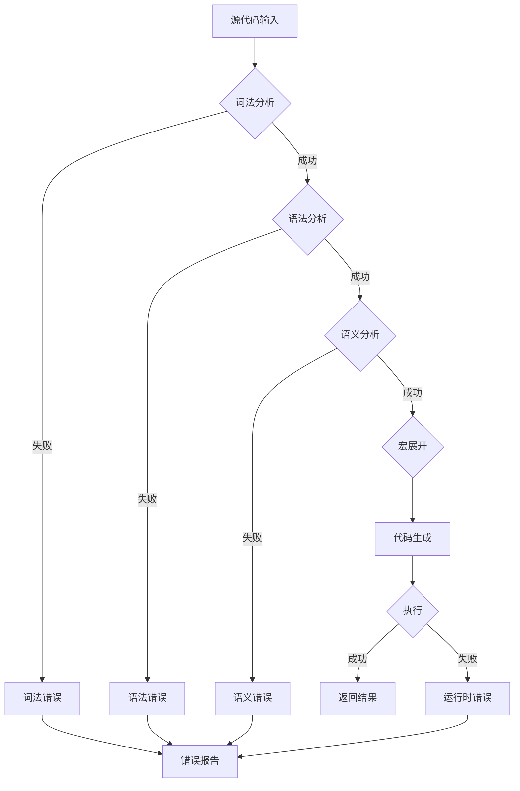
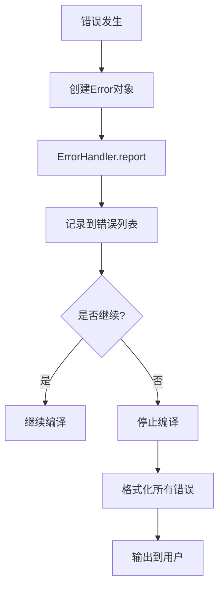

# 技术设计文档

## 文档信息
- **特性名称**: project-architecture-analysis
- **创建日期**: 2026-05-26
- **版本**: 1.0
- **状态**: 草稿
- **关联需求文档**: spec.md v1.0

## 1. 设计概述

### 1.1 设计目标

本次技术设计旨在为"心语"中文编程语言项目建立系统性的架构分析和优化方案，具体目标包括：

1. **架构清晰化**：明确各模块职责边界，建立清晰的接口契约
2. **安全性增强**：解决exec()执行的安全风险，提供沙箱隔离方案
3. **性能优化**：识别编译流程的性能瓶颈，提出优化策略
4. **可维护性提升**：建立代码规范、文档体系和测试标准
5. **扩展性保障**：设计灵活的扩展机制，支持语言特性的增量添加

### 1.2 设计原则

本次设计遵循以下核心原则：

- **单一职责原则（SRP）**：每个模块只负责一个编译阶段，职责清晰
- **开闭原则（OCP）**：通过抽象接口支持扩展，避免修改现有代码
- **依赖倒置原则（DIP）**：高层模块依赖抽象接口，而非具体实现
- **接口隔离原则（ISP）**：接口细粒度划分，避免冗余依赖
- **关注点分离**：编译逻辑、错误处理、性能监控相互独立

### 1.3 技术栈

**核心语言与版本**：
- Python 3.8+（使用dataclasses、typing、enum等现代特性）

**现有依赖**：
- ply 3.11（词法分析器生成，当前未使用）
- pytest 8.0.0（测试框架）
- pytest-cov 4.1.0（覆盖率报告）

**推荐工具链**：
- black：代码格式化
- isort：导入排序
- mypy：静态类型检查
- pre-commit：Git钩子管理
- sphinx：文档生成

**安全相关**：
- RestrictedPython：受限Python执行环境
- Docker：沙箱隔离（可选）

## 2. 架构设计

### 2.1 整体架构

心语语言采用经典的**多阶段编译器架构**，分为前端（分析）和后端（生成）两部分：

```
┌─────────────────────────────────────────────────────────────┐
│                        心语编译器                            │
├─────────────────────────────────────────────────────────────┤
│  前端（分析阶段）                                             │
│  ┌──────────┐   ┌──────────┐   ┌──────────┐                │
│  │  Lexer   │──▶│  Parser  │──▶│ Semantic │                │
│  │ 词法分析 │   │ 语法分析 │   │ 语义分析 │                │
│  └──────────┘   └──────────┘   └──────────┘                │
│       │              │              │                       │
│       ▼              ▼              ▼                       │
│    Tokens          AST         验证的AST                    │
├─────────────────────────────────────────────────────────────┤
│  中间层（变换阶段）                                           │
│  ┌──────────┐                                               │
│  │  Macro   │  宏展开、代码变换                              │
│  │  System  │                                               │
│  └──────────┘                                               │
├─────────────────────────────────────────────────────────────┤
│  后端（生成阶段）                                             │
│  ┌──────────┐   ┌──────────┐                               │
│  │ Codegen  │──▶│ Runtime  │                               │
│  │ 代码生成 │   │ 运行时   │                               │
│  └──────────┘   └──────────┘                               │
│       │              │                                      │
│       ▼              ▼                                      │
│  Python代码      执行结果                                   │
└─────────────────────────────────────────────────────────────┘
```

#### 架构图（Mermaid）



### 2.2 模块划分

| 模块名称 | 职责描述 | 关键接口 | 依赖模块 |
|----------|----------|----------|----------|
| **lexer** | 词法分析，将源代码转换为Token序列 | `tokenize() -> List[Token]` | tokens, keywords |
| **parser** | 语法分析，将Token序列转换为AST | `parse() -> ProgramNode` | ast_nodes, lexer |
| **semantic** | 语义分析，检查AST的语义正确性 | `analyze(ast) -> bool` | scope, type_inference |
| **codegen** | 代码生成，将AST转换为目标代码 | `generate(ast) -> str` | ast_nodes |
| **macro** | 宏系统，代码变换和展开 | `expand(ast) -> AST` | macro_system, builtin_macros |
| **runtime** | 运行时环境，执行生成的代码 | `execute(code) -> Any` | - |
| **error_handling** | 统一错误处理和报告 | `report(error)` | - |

### 2.3 组件交互

**编译流程的数据流**：

```
源代码 (str)
    ↓ Lexer.tokenize()
Token序列 (List[Token])
    ↓ Parser.parse()
抽象语法树 (ProgramNode)
    ↓ SemanticAnalyzer.analyze()
验证的AST (ProgramNode + 符号表)
    ↓ MacroExpander.expand()
变换的AST (ProgramNode)
    ↓ PythonCodegen.generate()
Python代码 (str)
    ↓ Runtime.execute()
执行结果 (Any)
```

**错误处理流程**：

```
错误发生
    ↓ ErrorHandler.report()
错误对象 (Error)
    ↓ ErrorHandler.format_error()
格式化错误信息 (str)
    ↓ 输出到用户
```

## 3. 详细设计

### 3.1 词法分析器（Lexer）设计

#### 3.1.1 类设计

```python
class Lexer:
    """词法分析器

    职责：将源代码字符串转换为Token序列

    属性：
        source: 源代码字符串
        pos: 当前位置索引
        line: 当前行号
        column: 当前列号
        indent_stack: 缩进栈（Python风格缩进处理）
    """

    def tokenize(self) -> List[Token]:
        """主词法分析方法"""
        pass

    def _scan_identifier(self) -> Token:
        """扫描标识符（支持中文）"""
        pass

    def _scan_number(self) -> Token:
        """扫描数字（整数和浮点数）"""
        pass

    def _scan_string(self) -> Token:
        """扫描字符串字面量"""
        pass

    def _handle_newline(self) -> None:
        """处理换行和缩进"""
        pass
```

#### 3.1.2 接口定义

```python
from typing import List
from dataclasses import dataclass
from enum import Enum, auto

class TokenType(Enum):
    """Token类型枚举"""
    NUMBER = auto()
    STRING = auto()
    IDENTIFIER = auto()
    VAR = auto()  # 定
    FUNCTION = auto()  # 函
    IF = auto()  # 若
    # ... 其他类型

@dataclass
class Token:
    """Token数据结构"""
    type: TokenType
    value: Any
    line: int
    column: int

class ILexer(Protocol):
    """词法分析器接口"""
    def tokenize(self) -> List[Token]:
        """将源代码转换为Token序列"""
        ...
```

#### 3.1.3 数据结构

**Token结构**：
- `type`: TokenType枚举，标识Token类型
- `value`: Any，Token的值（如数字、字符串、标识符名）
- `line`: int，所在行号（用于错误报告）
- `column`: int，所在列号（用于错误报告）

**关键字映射表**：
```python
ALL_KEYWORDS = {
    "定": TokenType.VAR,
    "函": TokenType.FUNCTION,
    "若": TokenType.IF,
    "真值": TokenType.TRUE,
    "假值": TokenType.FALSE,
    # ... 其他关键字
}
```

### 3.2 语法分析器（Parser）设计

#### 3.2.1 类设计

```python
class Parser:
    """语法分析器

    职责：将Token序列转换为抽象语法树（AST）
    方法：递归下降解析
    """

    def parse(self) -> ProgramNode:
        """主解析方法"""
        pass

    def _parse_statement(self) -> ASTNode:
        """解析语句"""
        pass

    def _parse_expression(self) -> ASTNode:
        """解析表达式"""
        pass

    def _parse_var_def(self) -> VarDefNode:
        """解析变量定义"""
        pass

    def _parse_function_def(self) -> FunctionDefNode:
        """解析函数定义"""
        pass

    def _parse_if(self) -> IfNode:
        """解析条件语句"""
        pass
```

#### 3.2.2 AST节点层次结构

```
ASTNode (抽象基类)
├── 字面量节点
│   ├── NumberNode
│   ├── StringNode
│   └── IdentifierNode
├── 表达式节点
│   ├── BinaryOpNode
│   ├── UnaryOpNode
│   ├── ListNode
│   ├── DictNode
│   ├── MemberAccessNode
│   └── IndexNode
├── 语句节点
│   ├── AssignNode
│   ├── VarDefNode
│   ├── IfNode
│   ├── ForNode
│   ├── WhileNode
│   ├── RepeatNode
│   ├── FunctionDefNode
│   ├── FunctionCallNode
│   └── ReturnNode
└── 特殊节点
    ├── ProgramNode (根节点)
    └── BlockNode
```

### 3.3 语义分析器（Semantic）设计

#### 3.3.1 类设计

```python
class SemanticAnalyzer:
    """语义分析器

    职责：
    - 作用域管理
    - 符号表构建
    - 类型检查和推断
    - 错误检测
    """

    def analyze(self, ast: ProgramNode) -> bool:
        """分析AST，返回是否通过"""
        pass

    def _visit(self, node: ASTNode) -> Any:
        """访问者模式入口"""
        pass

    def _visit_var_def(self, node: VarDefNode) -> None:
        """处理变量定义"""
        pass

    def _visit_function_call(self, node: FunctionCallNode) -> None:
        """检查函数调用"""
        pass
```

#### 3.3.2 作用域管理

```python
class Scope:
    """作用域管理

    支持嵌套作用域，用于变量查找和定义
    """

    def define(self, name: str, symbol_type: str, **attrs) -> None:
        """定义符号"""
        pass

    def resolve(self, name: str) -> Optional[Symbol]:
        """查找符号（沿作用域链向上查找）"""
        pass

    def enter_scope(self) -> 'Scope':
        """进入新作用域"""
        pass

    def exit_scope(self) -> 'Scope':
        """退出作用域"""
        pass
```

### 3.4 代码生成器（Codegen）设计

#### 3.4.1 类设计

```python
class PythonCodegen:
    """Python代码生成器

    职责：将AST转换为可执行的Python代码
    方法：访问者模式遍历AST
    """

    def generate(self, node: ASTNode) -> str:
        """生成Python代码"""
        pass

    def _generate_program(self, node: ProgramNode) -> str:
        """生成程序代码"""
        pass

    def _generate_function_def(self, node: FunctionDefNode) -> str:
        """生成函数定义"""
        pass

    def _generate_binary_op(self, node: BinaryOpNode) -> str:
        """生成二元操作"""
        pass
```

#### 3.4.2 操作符映射

```python
BINARY_OPERATORS = {
    "加": "+",
    "减": "-",
    "乘": "*",
    "除以": "/",
    "大于": ">",
    "小于": "<",
    "等于": "==",
    "且": "and",
    "或": "or",
    # ... 其他操作符
}
```

### 3.5 错误处理系统设计

#### 3.5.1 类设计

```python
class ErrorType(Enum):
    """错误类型"""
    LEXER_ERROR = auto()
    PARSER_ERROR = auto()
    SEMANTIC_ERROR = auto()
    RUNTIME_ERROR = auto()

@dataclass
class Error:
    """错误信息"""
    error_type: ErrorType
    message: str
    line: int
    column: int
    source: Optional[str] = None
    suggestion: Optional[str] = None  # 修复建议

class ErrorHandler:
    """统一错误处理器"""

    def report(self, error: Error) -> None:
        """报告错误"""
        pass

    def format_error(self, error: Error) -> str:
        """格式化错误信息（包含源代码上下文）"""
        pass

    def get_statistics(self) -> Dict[ErrorType, int]:
        """获取错误统计"""
        pass
```

### 3.6 宏系统设计

#### 3.6.1 类设计

```python
class MacroType(Enum):
    """宏类型"""
    SYNTAX = "syntax"  # 语法宏
    IDIOM = "idiom"    # 成语宏

@dataclass
class Macro:
    """宏定义"""
    name: str
    type: MacroType
    params: List[str]
    body: str
    description: Optional[str] = None

class MacroSystem:
    """宏系统核心"""

    def register(self, name: str, macro: Macro) -> None:
        """注册宏"""
        pass

    def expand(self, name: str, args: Dict[str, Any]) -> str:
        """展开宏（检测递归展开）"""
        pass
```

### 3.7 运行时环境设计

#### 3.7.1 安全执行方案

**方案一：受限环境（推荐）**

```python
class SecureRuntime:
    """安全运行时环境

    使用RestrictedPython限制危险操作
    """

    def execute(self, code: str, allowed_modules: Set[str] = None) -> Any:
        """在受限环境中执行代码"""
        from RestrictedPython import compile_restricted

        # 编译为受限代码
        byte_code = compile_restricted(code, '<inline>', 'exec')

        # 创建受限全局环境
        restricted_globals = self._create_restricted_globals(allowed_modules)

        # 执行
        exec(byte_code, restricted_globals)
        return restricted_globals.get('__result__')

    def _create_restricted_globals(self, allowed_modules: Set[str]) -> Dict:
        """创建受限全局环境"""
        return {
            '__builtins__': {
                'print': print,
                'len': len,
                'range': range,
                # 仅包含安全的内置函数
            }
        }
```

**方案二：沙箱隔离（Docker）**

```python
class DockerRuntime:
    """Docker沙箱运行时"""

    def execute(self, code: str) -> Any:
        """在Docker容器中执行代码"""
        import docker

        client = docker.from_env()
        container = client.containers.run(
            "python:3.8-slim",
            command=f"python -c '{code}'",
            remove=True,
            mem_limit="128m",  # 内存限制
            cpu_period=100000,
            cpu_quota=50000,   # CPU限制50%
            network_disabled=True  # 禁用网络
        )
        return container
```

## 4. 数据设计

### 4.1 数据模型

**编译上下文**：

```python
@dataclass
class CompilationContext:
    """编译上下文

    贯积编译过程中的状态和信息
    """
    source: str                    # 源代码
    tokens: List[Token] = None     # Token序列
    ast: ProgramNode = None        # 抽象语法树
    symbol_table: Dict = None      # 符号表
    errors: List[Error] = None     # 错误列表
    warnings: List[Error] = None   # 警告列表
    output: str = None             # 生成的代码
```

**符号表条目**：

```python
@dataclass
class Symbol:
    """符号表条目"""
    name: str                      # 符号名
    symbol_type: str               # 类型：variable, function, module
    value_type: Optional[str]      # 值类型：int, str, list等
    scope: 'Scope'                 # 所在作用域
    line: int                      # 定义位置
    is_builtin: bool = False       # 是否为内置符号
    params: Optional[List[str]]    # 函数参数列表
```

### 4.2 数据存储

**内存存储**：
- 编译过程中的所有数据结构（Token、AST、符号表）均存储在内存中
- 无需持久化存储（编译器是无状态的）

**缓存策略**（优化方案）：
```python
from functools import lru_cache

class CachedLexer:
    @lru_cache(maxsize=128)
    def tokenize_cached(self, source_hash: int) -> List[Token]:
        """缓存词法分析结果"""
        pass
```

## 5. API 设计

### 5.1 内部 API

**编译器主接口**：

```python
class ChineseProgram:
    """心语语言主类"""

    def run(self, source: str) -> Optional[Any]:
        """编译并执行心语代码

        Args:
            source: 心语源代码

        Returns:
            执行结果，或None（如果出错）
        """
        pass

    def compile(self, source: str) -> str:
        """编译心语代码为Python代码

        Args:
            source: 心语源代码

        Returns:
            生成的Python代码字符串
        """
        pass
```

**各阶段接口**：

```python
# 词法分析接口
def tokenize(source: str) -> List[Token]:
    """将源代码转换为Token序列"""

# 语法分析接口
def parse(tokens: List[Token]) -> ProgramNode:
    """将Token序列转换为AST"""

# 语义分析接口
def analyze(ast: ProgramNode) -> Tuple[bool, List[Error]]:
    """分析AST，返回是否通过和错误列表"""

# 代码生成接口
def generate(ast: ProgramNode) -> str:
    """将AST转换为目标代码"""
```

### 5.2 外部 API

**命令行接口**：

```bash
# 交互式模式
python -m src.main

# 执行文件
python -m src.main program.心语

# 执行代码字符串
python -m src.main -c '印"你好"。'

# 编译为Python
python -m src.main --compile program.心语
```

**Python API**：

```python
from src.main import ChineseProgram

program = ChineseProgram()

# 执行代码
result = program.run('定 x = 5。印x。')

# 编译代码
python_code = program.compile('定 x = 5。印x。')
```

## 6. 流程设计

### 6.1 核心业务流程

#### 编译流程图



#### 错误处理流程



### 6.2 异常处理流程

**异常层次结构**：

```python
class XinyuError(Exception):
    """心语语言基础异常"""
    pass

class LexerError(XinyuError):
    """词法错误"""
    pass

class ParseError(XinyuError):
    """语法错误"""
    pass

class SemanticError(XinyuError):
    """语义错误"""
    pass

class CodegenError(XinyuError):
    """代码生成错误"""
    pass

class RuntimeError(XinyuError):
    """运行时错误"""
    pass
```

## 7. 技术决策

### 7.1 关键决策记录

| 决策项 | 选项 | 最终决策 | 决策理由 |
|--------|------|----------|----------|
| **解析方法** | 递归下降 / LR / LL(1) | 递归下降 | 实现简单，易于扩展，适合手写解析器 |
| **AST表示** | 类层次 / 字典 / namedtuple | 类层次（dataclass） | 类型安全，支持访问者模式，易于调试 |
| **错误处理** | 异常 / 错误码 / Result类型 | 异常 + 错误收集 | Python惯例，支持错误恢复和继续分析 |
| **类型推断** | 静态类型 / 动态类型 / 混合 | 动态类型 + 可选推断 | 保持灵活性，支持渐进式类型检查 |
| **代码生成目标** | Python / 字节码 / C | Python | 快速实现，利用Python生态，易于调试 |
| **安全执行** | exec / RestrictedPython / Docker | RestrictedPython（推荐） | 平衡安全性和易用性 |
| **宏系统** | 文本替换 / AST变换 | AST变换 | 更安全，支持语法检查，避免意外展开 |
| **测试框架** | unittest / pytest | pytest | 更简洁的语法，丰富的插件生态 |

### 7.2 技术风险

| 风险项 | 影响程度 | 发生概率 | 应对措施 |
|--------|----------|----------|----------|
| **exec()安全风险** | 高 | 高 | 实现RestrictedPython方案，提供Docker沙箱选项 |
| **性能瓶颈** | 中 | 中 | 实现缓存机制，优化正则表达式，支持增量编译 |
| **类型推断不完整** | 低 | 中 | 提供类型注解语法，支持渐进式类型检查 |
| **宏展开递归** | 中 | 低 | 实现展开深度限制，检测循环展开 |
| **编码问题** | 中 | 低 | 强制UTF-8编码，提供编码检测和转换 |
| **依赖冲突** | 低 | 低 | 使用虚拟环境，固定依赖版本 |

## 8. 性能设计

### 8.1 性能目标

| 指标 | 当前值 | 目标值 | 测量方法 |
|------|--------|--------|----------|
| **编译速度** | 未测量 | 1000行 < 5秒 | pytest-benchmark |
| **内存占用** | 未测量 | < 100MB（1MB源文件） | memory_profiler |
| **启动时间** | 未测量 | < 100ms | time测量 |
| **测试覆盖率** | 77% | 85% | pytest-cov |

### 8.2 优化策略

**编译性能优化**：

1. **缓存机制**：
   ```python
   from functools import lru_cache

   @lru_cache(maxsize=256)
   def tokenize_cached(source_hash: int, source: str) -> List[Token]:
       return Lexer(source).tokenize()
   ```

2. **增量编译**：
   ```python
   class IncrementalCompiler:
       def compile(self, source: str, changed_lines: Set[int]) -> str:
           """仅重新编译改变的行"""
           pass
   ```

3. **并行处理**（多文件编译）：
   ```python
   from concurrent.futures import ProcessPoolExecutor

   def compile_parallel(files: List[str]) -> List[str]:
       with ProcessPoolExecutor() as executor:
           return list(executor.map(compile, files))
   ```

**内存优化**：

1. **流式处理**（大文件）：
   ```python
   class StreamingLexer:
       def tokenize_stream(self, file_handle) -> Iterator[Token]:
           """流式生成Token，避免一次性加载"""
           pass
   ```

2. **对象池**（复用Token对象）：
   ```python
   from objectpool import ObjectPool

   token_pool = ObjectPool(Token)
   ```

## 9. 安全设计

### 9.1 安全措施

**多层防御策略**：

```
┌─────────────────────────────────────┐
│  第1层：输入验证                     │
│  - 检查源代码长度限制                 │
│  - 检测可疑模式（如exec、eval）       │
│  - 验证编码格式                      │
├─────────────────────────────────────┤
│  第2层：编译时检查                    │
│  - 语义分析检测危险操作               │
│  - 禁止访问敏感模块（os、sys）        │
│  - 限制递归深度                      │
├─────────────────────────────────────┤
│  第3层：运行时隔离                    │
│  - RestrictedPython限制              │
│  - 受限的全局环境                    │
│  - 资源限制（内存、CPU、时间）        │
├─────────────────────────────────────┤
│  第4层：沙箱隔离（可选）              │
│  - Docker容器隔离                    │
│  - 网络隔离                          │
│  - 文件系统隔离                      │
└─────────────────────────────────────┘
```

**输入验证规则**：

```python
def validate_source(source: str) -> Tuple[bool, Optional[str]]:
    """验证源代码安全性"""

    # 长度限制
    if len(source) > MAX_SOURCE_LENGTH:
        return False, "源代码过长"

    # 危险模式检测
    dangerous_patterns = [
        r'__import__',
        r'eval\s*\(',
        r'exec\s*\(',
        r'open\s*\(',
    ]
    for pattern in dangerous_patterns:
        if re.search(pattern, source):
            return False, f"检测到危险模式: {pattern}"

    return True, None
```

### 9.2 权限控制

**受限全局环境**：

```python
def create_safe_globals() -> Dict[str, Any]:
    """创建安全的执行环境"""
    return {
        '__builtins__': {
            # 允许的内置函数
            'print': print,
            'len': len,
            'range': range,
            'list': list,
            'dict': dict,
            'str': str,
            'int': int,
            'float': float,
            'bool': bool,

            # 禁止的函数（不包含）
            # 'eval': ...,
            # 'exec': ...,
            # 'open': ...,
            # '__import__': ...,
        },

        # 允许的模块
        'math': math,
        'random': random,
        'json': json,

        # 心语内置值
        '真': True,
        '假': False,
    }
```

## 10. 测试设计

### 10.1 测试策略

**测试金字塔**：

```
        /\
       /  \  端到端测试（E2E）
      /────\  - 完整编译流程
     /      \  - REPL交互测试
    /────────\
   /  集成测试  \  - 模块间交互
  /──────────────\  - 错误处理流程
 /                \
/    单元测试      \  - 各模块功能
────────────────────  - 边界条件
                      - 异常处理
```

**测试覆盖率目标**：
- 单元测试：85%
- 集成测试：覆盖关键路径
- 端到端测试：覆盖所有语言特性

### 10.2 测试场景

**词法分析测试**：
- 中文关键字识别
- 中文操作符识别
- 数字和字符串字面量
- 缩进处理
- 错误恢复

**语法分析测试**：
- 表达式解析
- 语句解析
- 控制流结构
- 函数定义和调用
- 错误恢复

**语义分析测试**：
- 变量定义和使用
- 作用域管理
- 类型检查
- 函数调用验证

**代码生成测试**：
- 各AST节点的代码生成
- 操作符映射
- 内置函数映射
- 缩进处理

**安全测试**：
- 代码注入防护
- 危险操作检测
- 沙箱隔离验证

**性能测试**：
- 大文件编译
- 内存使用
- 并发编译

## 11. 部署设计

### 11.1 部署架构

**开发环境**：
```
本地开发
├── Python 3.8+ 虚拟环境
├── 依赖安装（requirements.txt）
├── pre-commit钩子
└── 测试运行（pytest）
```

**生产环境**：
```
生产部署
├── pip安装（pip install xinyu）
├── 命令行工具（xinyu命令）
├── Python API（import xinyu）
└── 可选：Docker镜像
```

**Docker部署**（可选）：
```dockerfile
FROM python:3.8-slim

WORKDIR /app
COPY requirements.txt .
RUN pip install --no-cache-dir -r requirements.txt

COPY src/ ./src/
COPY stdlib/ ./stdlib/

ENTRYPOINT ["python", "-m", "src.main"]
```

### 11.2 配置管理

**配置文件**（xinyu.yaml）：

```yaml
# 心语语言配置
compiler:
  max_source_length: 1048576  # 1MB
  max_recursion_depth: 1000
  enable_cache: true

runtime:
  execution_mode: "restricted"  # restricted, docker, native
  allowed_modules:
    - math
    - random
    - json
  memory_limit: "128m"
  cpu_limit: "50%"
  timeout: 30

security:
  enable_input_validation: true
  enable_dangerous_pattern_detection: true
  sandbox_enabled: false

logging:
  level: INFO
  format: "%(asctime)s - %(name)s - %(levelname)s - %(message)s"
```

**环境变量**：

```bash
XINYU_EXECUTION_MODE=restricted
XINYU_MEMORY_LIMIT=128m
XINYU_TIMEOUT=30
XINYU_LOG_LEVEL=INFO
```

## 12. 附录

### 12.1 参考资料

- [编译原理（龙书）](https://en.wikipedia.org/wiki/Compilers:_Principles,_Techniques,_and_Tools)
- [Python语言参考](https://docs.python.org/zh-cn/3/reference/)
- [RestrictedPython文档](https://github.com/zopefoundation/RestrictedPython)
- [LSP协议规范](https://microsoft.github.io/language-server-protocol/)
- [pytest最佳实践](https://docs.pytest.org/en/stable/goodpractices.html)

### 12.2 术语表

| 术语 | 定义 |
|------|------|
| AST | 抽象语法树（Abstract Syntax Tree） |
| Token | 词法单元，词法分析器的输出 |
| 递归下降解析 | 一种自顶向下的解析方法，每个非终结符对应一个解析函数 |
| 访问者模式 | 一种设计模式，用于遍历和操作复杂对象结构（如AST） |
| 作用域 | 变量和函数的可见范围 |
| 符号表 | 记录标识符信息的表结构 |
| 类型推断 | 自动推导表达式类型的过程 |
| 沙箱 | 一种隔离执行环境，限制程序权限 |
| RestrictedPython | Python的一个受限子集，禁止危险操作 |

### 12.3 变更历史

| 版本 | 日期 | 修改人 | 修改内容 |
|------|------|--------|----------|
| 1.0 | 2026-05-26 | - | 初始版本 |
