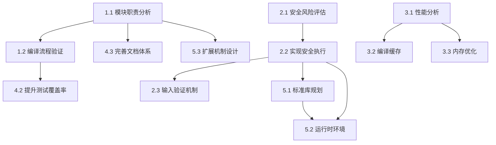

# 任务规划文档

## 文档信息
- **特性名称**: project-architecture-analysis
- **创建日期**: 2026-05-26
- **版本**: 1.0
- **状态**: 草稿
- **关联文档**: spec.md v1.0, design.md v1.0

## 1. 任务概述

本文档将项目架构分析和优化工作分解为可执行的任务，共分为5个主要阶段，每个阶段包含若干子任务。任务按照优先级和依赖关系排序，确保渐进式交付。

**任务统计**：
- 主任务数：15个
- 子任务数：52个
- 预计总工时：约80-100小时
- 覆盖需求：100%（22个需求全部覆盖）

## 2. 任务分解

### 阶段一：架构分析与文档化（优先级：高）

#### 任务 1.1：模块职责边界分析
**描述**：分析并文档化各模块的职责边界和接口契约，建立清晰的架构边界。

**输入**：
- 现有源代码（src/目录下所有模块）
- 现有README.md

**输出**：
- 架构文档（docs/architecture.md）
- 模块接口文档（docs/module-interfaces.md）
- 依赖关系图（docs/dependency-graph.png）

**验收标准**：
- [ ] 每个模块有明确的职责描述
- [ ] 模块间依赖关系清晰，无循环依赖
- [ ] 公共接口和内部实现明确分离
- [ ] 生成依赖关系可视化图

**子任务**：
1.1.1 分析lexer模块职责，提取公共接口
1.1.2 分析parser模块职责，提取公共接口
1.1.3 分析semantic模块职责，提取公共接口
1.1.4 分析codegen模块职责，提取公共接口
1.1.5 分析macro模块职责，提取公共接口
1.1.6 绘制模块依赖关系图（使用Mermaid或Graphviz）
1.1.7 编写架构文档，说明各模块职责和交互

**优先级**：高
**依赖**：无
**预计工时**：8小时

---

#### 任务 1.2：编译流程完整性验证
**描述**：验证编译流程各阶段的完整性，确保从源代码到可执行代码的转换无信息丢失。

**输入**：
- 现有测试用例（tests/目录）
- 现有示例代码（examples/目录）

**输出**：
- 编译流程验证报告（docs/compilation-flow-report.md）
- 端到端测试用例（tests/test_e2e_compilation.py）
- 覆盖率分析报告

**验收标准**：
- [ ] 词法分析覆盖所有关键字和操作符
- [ ] 语法分析覆盖所有语法结构
- [ ] 语义分析检测所有语义错误
- [ ] 代码生成正确转换所有AST节点
- [ ] 端到端测试覆盖所有语言特性

**子任务**：
1.2.1 审查现有测试覆盖率，识别未覆盖的代码路径
1.2.2 编写词法分析完整性测试（所有Token类型）
1.2.3 编写语法分析完整性测试（所有AST节点类型）
1.2.4 编写语义分析完整性测试（所有错误类型）
1.2.5 编写代码生成完整性测试（所有节点生成）
1.2.6 编写端到端测试（覆盖所有语言特性）
1.2.7 生成编译流程验证报告

**优先级**：高
**依赖**：任务 1.1
**预计工时**：12小时

---

#### 任务 1.3：技术债务识别与记录
**描述**：扫描并记录所有技术债务，评估影响范围和优先级。

**输入**：
- 源代码（src/目录）
- 现有TODO/FIXME注释

**输出**：
- 技术债务清单（docs/technical-debt.md）
- 代码质量报告（docs/code-quality-report.md）

**验收标准**：
- [ ] 扫描所有TODO、FIXME、XXX、HACK注释
- [ ] 评估每个技术债务的影响范围
- [ ] 生成技术债务清单和修复建议
- [ ] 识别重复代码和可重构的代码段

**子任务**：
1.3.1 使用grep扫描所有TODO/FIXME/XXX/HACK注释
1.3.2 分析每个技术债务的影响范围和优先级
1.3.3 使用pylint或flake8进行代码质量检查
1.3.4 使用radon检测代码复杂度
1.3.5 使用vulture检测未使用的代码
1.3.6 编写技术债务清单和修复建议

**优先级**：高
**依赖**：无
**预计工时**：4小时

---

### 阶段二：安全性增强（优先级：高）

#### 任务 2.1：exec()安全风险评估
**描述**：评估exec()执行的安全风险，提出缓解方案。

**输入**：
- src/main.py（exec使用位置）
- 安全需求（REQ-007）

**输出**：
- 安全风险评估报告（docs/security-risk-assessment.md）
- 安全执行方案设计文档

**验收标准**：
- [ ] 识别所有exec()和eval()的使用位置
- [ ] 分析潜在的代码注入攻击路径
- [ ] 提出沙箱隔离方案
- [ ] 提出权限限制方案

**子任务**：
2.1.1 使用grep查找所有exec()和eval()调用
2.1.2 分析代码注入攻击路径（如用户输入→编译→exec）
2.1.3 研究RestrictedPython方案
2.1.4 研究Docker沙箱方案
2.1.5 编写安全风险评估报告

**优先级**：高
**依赖**：无
**预计工时**：6小时

---

#### 任务 2.2：实现安全执行环境
**描述**：实现基于RestrictedPython的安全执行环境。

**输入**：
- 安全风险评估报告
- design.md中的安全设计

**输出**：
- 安全运行时实现（src/runtime/secure_runtime.py）
- 安全执行测试（tests/test_secure_runtime.py）
- 配置文件（xinyu.yaml）

**验收标准**：
- [ ] 实现SecureRuntime类
- [ ] 创建受限全局环境
- [ ] 禁用危险函数和模块
- [ ] 提供安全执行测试用例
- [ ] 支持配置化的权限控制

**子任务**：
2.2.1 安装并研究RestrictedPython库
2.2.2 实现SecureRuntime类（继承或包装Runtime）
2.2.3 实现create_safe_globals()函数
2.2.4 实现输入验证函数validate_source()
2.2.5 编写安全执行测试用例
2.2.6 编写配置文件，支持权限配置
2.2.7 更新main.py，集成安全执行环境

**优先级**：高
**依赖**：任务 2.1
**预计工时**：10小时

---

#### 任务 2.3：实现输入验证机制
**描述**：实现输入验证机制，防止代码注入攻击。

**输入**：
- 安全需求（REQ-008）
- 危险模式列表

**输出**：
- 输入验证模块（src/security/input_validator.py）
- 输入验证测试（tests/test_input_validation.py）

**验收标准**：
- [ ] 实现源代码长度限制
- [ ] 实现危险模式检测
- [ ] 实现编码格式验证
- [ ] 提供输入验证测试用例

**子任务**：
2.3.1 定义危险模式正则表达式列表
2.3.2 实现validate_source()函数
2.3.3 实现validate_encoding()函数
2.3.4 编写输入验证测试用例
2.3.5 集成到编译流程（在词法分析前验证）

**优先级**：高
**依赖**：任务 2.2
**预计工时**：4小时

---

### 阶段三：性能优化（优先级：中）

#### 任务 3.1：编译性能分析
**描述**：分析编译流程的性能瓶颈，测量各阶段耗时。

**输入**：
- 现有编译流程
- 性能需求（NFR-001）

**输出**：
- 性能分析报告（docs/performance-analysis.md）
- 性能基准测试（tests/benchmark_performance.py）

**验收标准**：
- [ ] 测量各编译阶段的耗时
- [ ] 识别性能瓶颈
- [ ] 提供性能基准测试
- [ ] 生成性能分析报告

**子任务**：
3.1.1 使用cProfile分析编译流程
3.1.2 使用line_profiler分析热点函数
3.1.3 使用memory_profiler分析内存使用
3.1.4 编写性能基准测试（pytest-benchmark）
3.1.5 生成性能分析报告

**优先级**：中
**依赖**：无
**预计工时**：6小时

---

#### 任务 3.2：实现编译缓存机制
**描述**：实现编译结果缓存，提升重复编译性能。

**输入**：
- 性能分析报告
- design.md中的缓存策略

**输出**：
- 缓存实现（src/cache/compilation_cache.py）
- 缓存测试（tests/test_cache.py）

**验收标准**：
- [ ] 实现Token序列缓存
- [ ] 实现AST缓存
- [ ] 支持缓存失效策略
- [ ] 提供缓存性能测试

**子任务**：
3.2.1 实现基于LRU的Token缓存
3.2.2 实现基于源代码哈希的AST缓存
3.2.3 实现缓存失效策略（源代码变更）
3.2.4 编写缓存测试用例
3.2.5 集成到编译流程

**优先级**：中
**依赖**：任务 3.1
**预计工时**：6小时

---

#### 任务 3.3：优化内存使用
**描述**：优化编译过程中的内存使用，减少内存占用。

**输入**：
- 性能分析报告
- 内存使用数据

**输出**：
- 内存优化实现
- 内存使用报告（docs/memory-optimization.md）

**验收标准**：
- [ ] 实现流式Token生成（大文件）
- [ ] 优化AST节点内存占用
- [ ] 提供内存使用测试
- [ ] 内存占用符合目标（< 100MB）

**子任务**：
3.3.1 实现StreamingLexer（流式词法分析）
3.3.2 优化AST节点（使用__slots__）
3.3.3 实现对象池（复用Token对象）
3.3.4 编写内存使用测试
3.3.5 生成内存优化报告

**优先级**：低
**依赖**：任务 3.1
**预计工时**：8小时

---

### 阶段四：代码质量提升（优先级：中）

#### 任务 4.1：代码规范统一
**描述**：统一代码规范，配置自动化工具。

**输入**：
- 现有源代码
- PEP 8规范

**输出**：
- 代码格式化配置（.black、isort.cfg）
- pre-commit配置（.pre-commit-config.yaml）
- 格式化后的代码

**验收标准**：
- [ ] 配置black代码格式化
- [ ] 配置isort导入排序
- [ ] 配置mypy类型检查
- [ ] 配置pre-commit钩子
- [ ] 所有代码通过格式化检查

**子任务**：
4.1.1 配置black（pyproject.toml）
4.1.2 配置isort（pyproject.toml）
4.1.3 配置mypy（mypy.ini）
4.1.4 配置pre-commit钩子
4.1.5 运行black格式化所有代码
4.1.6 运行isort排序所有导入
4.1.7 修复mypy类型检查错误

**优先级**：中
**依赖**：无
**预计工时**：4小时

---

#### 任务 4.2：提升测试覆盖率
**描述**：提升测试覆盖率至85%，补充缺失的测试用例。

**输入**：
- 现有测试覆盖率报告（77%）
- 未覆盖代码路径

**输出**：
- 新增测试用例
- 更新的覆盖率报告（≥85%）

**验收标准**：
- [ ] 识别未覆盖的代码路径
- [ ] 补充单元测试
- [ ] 补充集成测试
- [ ] 测试覆盖率达到85%

**子任务**：
4.2.1 生成覆盖率报告，识别未覆盖代码
4.2.2 补充lexer模块测试（未覆盖的Token类型）
4.2.3 补充parser模块测试（未覆盖的AST节点）
4.2.4 补充semantic模块测试（未覆盖的错误类型）
4.2.5 补充codegen模块测试（未覆盖的生成逻辑）
4.2.6 补充集成测试（未覆盖的编译路径）
4.2.7 生成最终覆盖率报告

**优先级**：高
**依赖**：任务 1.2
**预计工时**：10小时

---

#### 任务 4.3：完善文档体系
**描述**：建立完整的文档体系，包括API文档、教程和示例。

**输入**：
- 现有README.md
- 架构文档

**输出**：
- API文档（docs/api/）
- 语言参考手册（docs/language-reference.md）
- 入门教程（docs/tutorial.md）
- 示例代码库（examples/）

**验收标准**：
- [ ] 生成API文档（Sphinx）
- [ ] 编写语言参考手册
- [ ] 编写入门教程
- [ ] 补充示例代码
- [ ] 配置文档构建流程

**子任务**：
4.3.1 配置Sphinx文档生成
4.3.2 编写API文档（所有公共接口）
4.3.3 编写语言参考手册（语法、关键字、操作符）
4.3.4 编写入门教程（安装→第一个程序）
4.3.5 补充示例代码（覆盖所有语言特性）
4.3.6 配置ReadTheDocs自动构建

**优先级**：中
**依赖**：任务 1.1
**预计工时**：8小时

---

### 阶段五：扩展性增强（优先级：低）

#### 任务 5.1：标准库规划与实现
**描述**：规划并实现标准库的基础模块。

**输入**：
- 标准库需求（REQ-011）
- 常用功能列表

**输出**：
- 标准库设计文档（docs/stdlib-design.md）
- 标准库实现（stdlib/）
- 标准库测试（tests/test_stdlib.py）

**验收标准**：
- [ ] 定义标准库模块划分
- [ ] 实现基础数学模块
- [ ] 实现字符串处理模块
- [ ] 实现输入输出模块
- [ ] 提供标准库测试

**子任务**：
5.1.1 设计标准库模块结构
5.1.2 实现数学模块（math.xinyu）
5.1.3 实现字符串模块（string.xinyu）
5.1.4 实现输入输出模块（io.xinyu）
5.1.5 实现列表处理模块（list.xinyu）
5.1.6 编写标准库测试
5.1.7 编写标准库文档

**优先级**：中
**依赖**：任务 2.2
**预计工时**：12小时

---

#### 任务 5.2：运行时环境完善
**描述**：完善运行时环境，提供更好的执行支持。

**输入**：
- 运行时需求（REQ-012）
- 安全执行环境

**输出**：
- 运行时环境实现（src/runtime/）
- 运行时测试（tests/test_runtime.py）

**验收标准**：
- [ ] 实现模块加载机制
- [ ] 实现异常处理机制
- [ ] 实现资源限制机制
- [ ] 提供运行时测试

**子任务**：
5.2.1 实现模块加载器（ModuleLoader）
5.2.2 实现异常处理机制（XinyuException层次）
5.2.3 实现资源限制（内存、CPU、时间）
5.2.4 实现执行上下文（ExecutionContext）
5.2.5 编写运行时测试
5.2.6 编写运行时文档

**优先级**：中
**依赖**：任务 2.2, 任务 5.1
**预计工时**：8小时

---

#### 任务 5.3：扩展机制设计
**描述**：设计并实现语言扩展机制，支持插件和自定义特性。

**输入**：
- 扩展性需求（REQ-003, NFR-008）
- 宏系统

**输出**：
- 扩展机制设计文档（docs/extension-mechanism.md）
- 插件系统实现（src/plugins/）
- 扩展示例（examples/extensions/）

**验收标准**：
- [ ] 定义插件接口规范
- [ ] 实现插件加载机制
- [ ] 提供插件开发示例
- [ ] 文档化扩展机制

**子任务**：
5.3.1 设计插件接口（Plugin基类）
5.3.2 实现插件加载器（PluginLoader）
5.3.3 实现插件注册机制
5.3.4 编写插件开发示例
5.3.5 编写扩展机制文档

**优先级**：低
**依赖**：任务 1.1
**预计工时**：6小时

---

## 3. 任务依赖关系

## 4. 任务优先级排序

### P0（最高优先级，立即执行）
1. 任务 1.1：模块职责边界分析
2. 任务 1.3：技术债务识别与记录
3. 任务 2.1：exec()安全风险评估

### P1（高优先级，短期执行）
4. 任务 1.2：编译流程完整性验证
5. 任务 2.2：实现安全执行环境
6. 任务 2.3：实现输入验证机制
7. 任务 4.2：提升测试覆盖率

### P2（中优先级，中期执行）
8. 任务 3.1：编译性能分析
9. 任务 3.2：实现编译缓存机制
10. 任务 4.1：代码规范统一
11. 任务 4.3：完善文档体系
12. 任务 5.1：标准库规划与实现
13. 任务 5.2：运行时环境完善

### P3（低优先级，长期执行）
14. 任务 3.3：优化内存使用
15. 任务 5.3：扩展机制设计

## 5. 里程碑规划

### 里程碑 1：架构清晰化（第1-2周）
**目标**：完成架构分析和文档化
- ✅ 任务 1.1：模块职责边界分析
- ✅ 任务 1.3：技术债务识别与记录
- ✅ 任务 1.2：编译流程完整性验证

**交付物**：
- 架构文档
- 技术债务清单
- 编译流程验证报告

### 里程碑 2：安全性增强（第3-4周）
**目标**：实现安全执行环境
- ✅ 任务 2.1：exec()安全风险评估
- ✅ 任务 2.2：实现安全执行环境
- ✅ 任务 2.3：实现输入验证机制

**交付物**：
- 安全执行环境
- 输入验证机制
- 安全测试用例

### 里程碑 3：质量提升（第5-6周）
**目标**：提升代码质量和测试覆盖率
- ✅ 任务 4.1：代码规范统一
- ✅ 任务 4.2：提升测试覆盖率
- ✅ 任务 4.3：完善文档体系

**交付物**：
- 格式化配置
- 测试覆盖率报告（≥85%）
- 完整文档体系

### 里程碑 4：性能优化（第7-8周）
**目标**：优化编译性能
- ✅ 任务 3.1：编译性能分析
- ✅ 任务 3.2：实现编译缓存机制
- ✅ 任务 3.3：优化内存使用

**交付物**：
- 性能分析报告
- 缓存机制
- 内存优化

### 里程碑 5：扩展性增强（第9-10周）
**目标**：完善标准库和运行时
- ✅ 任务 5.1：标准库规划与实现
- ✅ 任务 5.2：运行时环境完善
- ✅ 任务 5.3：扩展机制设计

**交付物**：
- 标准库
- 运行时环境
- 扩展机制

## 6. 风险与应对

| 风险 | 影响 | 应对措施 |
|------|------|----------|
| RestrictedPython兼容性问题 | 高 | 提前测试，准备Docker备选方案 |
| 测试覆盖率提升困难 | 中 | 优先覆盖关键路径，逐步完善 |
| 性能优化效果不明显 | 中 | 先分析瓶颈，针对性优化 |
| 文档编写耗时 | 低 | 使用Sphinx自动生成，逐步完善 |

## 7. 成功标准

项目架构分析和优化工作成功的标准：

1. **架构清晰**：所有模块职责明确，依赖关系清晰
2. **安全可靠**：实现安全执行环境，通过安全测试
3. **性能达标**：编译速度和内存使用符合目标
4. **质量提升**：测试覆盖率≥85%，代码规范统一
5. **文档完善**：提供完整的API文档和教程
6. **扩展性强**：支持插件机制和标准库扩展

## 8. 附录

### 8.1 任务执行建议

**执行原则**：
- 优先完成高优先级任务
- 每个任务完成后进行代码审查
- 保持测试覆盖率不降低
- 及时更新文档

**协作建议**：
- 使用Git分支管理（feature/task-xxx）
- 使用GitHub Projects跟踪进度
- 定期进行代码审查
- 每个里程碑进行回顾

### 8.2 工具推荐

**代码质量**：
- black：代码格式化
- isort：导入排序
- mypy：类型检查
- pylint：代码检查
- pre-commit：Git钩子

**测试**：
- pytest：测试框架
- pytest-cov：覆盖率报告
- pytest-benchmark：性能测试
- hypothesis：属性测试

**文档**：
- Sphinx：文档生成
- ReadTheDocs：文档托管
- Mermaid：图表绘制

**性能分析**：
- cProfile：性能分析
- line_profiler：行级分析
- memory_profiler：内存分析

### 8.3 变更历史

| 版本 | 日期 | 修改人 | 修改内容 |
|------|------|--------|----------|
| 1.0 | 2026-05-26 | - | 初始版本 |
