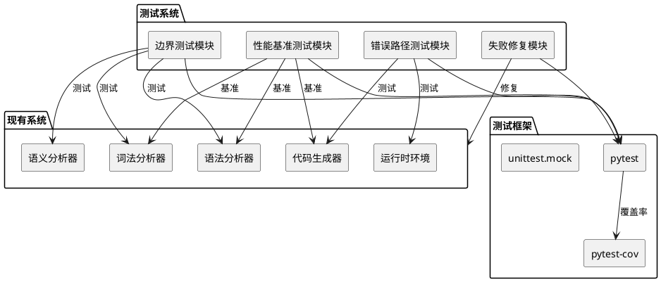

# 测试覆盖率提升实现设计

## 1. 实现模型

### 1.1 上下文视图



### 1.2 服务/组件总体架构

#### 测试模块架构

```
tests/
├── test_boundary/           # 新增：边界情况测试
│   ├── test_lexer_boundary.py
│   ├── test_parser_boundary.py
│   ├── test_semantic_boundary.py
│   └── test_codegen_boundary.py
├── test_error_paths/        # 新增：错误路径测试
│   ├── test_compile_errors.py
│   ├── test_runtime_errors.py
│   └── test_security_errors.py
├── test_performance/        # 新增：性能基准测试
│   ├── test_compile_benchmark.py
│   ├── test_runtime_benchmark.py
│   └── benchmark_utils.py
├── test_fixes/              # 新增：修复验证测试
│   └── test_fixed_issues.py
└── [现有测试文件]
```

#### 覆盖率分析流程

```
1. 运行测试套件 → 2. 收集覆盖率数据 → 3. 生成报告
                ↓
4. 分析未覆盖代码 → 5. 设计补充测试 → 6. 实现测试用例
                ↓
7. 验证覆盖率提升 → 8. 达到目标(≥80%)
```

### 1.3 实现设计文档

#### 1.3.1 边界测试设计

**词法分析器边界测试**

| 测试场景 | 输入 | 预期输出 | 覆盖目标 |
|---------|------|----------|----------|
| 空字符串 | `""` | 空token列表 | lexer空输入处理 |
| 超长字符串 | 10000+字符 | 正确分词 | lexer性能边界 |
| 仅空白字符 | `"   \n\t  "` | 空token列表 | lexer空白处理 |
| 特殊字符 | `"@#$%^&"` | 词法错误 | lexer错误处理 |
| Unicode字符 | `"中文变量"` | 正确识别 | lexer Unicode支持 |
| 嵌套注释 | `/* /* */ */` | 正确处理 | lexer注释嵌套 |
| 未闭合字符串 | `"未闭合` | 词法错误 | lexer字符串边界 |

**语法分析器边界测试**

| 测试场景 | 输入 | 预期输出 | 覆盖目标 |
|---------|------|----------|----------|
| 空程序 | `""` | 空AST | parser空输入 |
| 深度嵌套 | 100层嵌套 | 栈溢出错误 | parser深度限制 |
| 空函数体 | `定义 函数()：` | 正确AST | parser空体处理 |
| 参数过多 | 100个参数 | 参数错误 | parser参数限制 |
| 递归定义 | A引用B，B引用A | 循环错误 | parser循环检测 |
| 不完整语句 | `如果 真` | 语法错误 | parser语句完整性 |

**语义分析器边界测试**

| 测试场景 | 输入 | 预期输出 | 覆盖目标 |
|---------|------|----------|----------|
| 未定义变量 | 使用未声明变量 | 名称错误 | semantic变量检查 |
| 类型冲突 | 整数赋值字符串 | 类型错误 | semantic类型检查 |
| 作用域冲突 | 同名变量嵌套 | 作用域警告 | semantic作用域 |
| 循环依赖 | 模块互相导入 | 依赖错误 | semantic依赖检查 |
| 无限递归 | 函数调用自身 | 递归警告 | semantic递归检测 |

#### 1.3.2 错误路径测试设计

**编译错误路径测试**

```python
# 测试结构设计
class TestCompileErrors:
    def test_lexer_error_recovery():
        """测试词法错误恢复机制"""
        # 输入包含非法字符
        # 验证错误位置和消息正确
        # 验证后续代码继续处理

    def test_parser_error_recovery():
        """测试语法错误恢复机制"""
        # 输入包含语法错误
        # 验证错误位置和消息正确
        # 验证部分AST生成

    def test_semantic_error_recovery():
        """测试语义错误恢复机制"""
        # 输入包含语义错误
        # 验证错误位置和消息正确
        # 验证错误收集不中断
```

**运行时错误路径测试**

| 错误类型 | 触发场景 | 预期行为 | 测试方法 |
|---------|---------|----------|----------|
| 除零错误 | `1 / 0` | 抛出ZeroDivisionError | pytest.raises |
| 索引越界 | `列表[100]` | 抛出IndexError | pytest.raises |
| 类型错误 | `"文本" + 123` | 抛出TypeError | pytest.raises |
| 属性错误 | `对象.不存在` | 抛出AttributeError | pytest.raises |
| 键错误 | `字典["不存在"]` | 抛出KeyError | pytest.raises |
| 递归过深 | 无限递归函数 | 抛出RecursionError | pytest.raises |

**安全错误路径测试**

```python
class TestSecurityErrors:
    def test_code_injection():
        """测试代码注入防护"""
        # 尝试注入恶意代码
        # 验证被安全运行时拦截

    def test_unauthorized_access():
        """测试未授权访问防护"""
        # 尝试访问受限资源
        # 验证权限检查生效

    def test_resource_exhaustion():
        """测试资源耗尽防护"""
        # 尝试消耗大量资源
        # 验证资源限制生效
```

#### 1.3.3 性能基准测试设计

**基准测试框架**

```python
# benchmark_utils.py
import time
import statistics
from functools import wraps

def benchmark(iterations=10, warmup=2):
    """性能基准测试装饰器"""
    def decorator(func):
        @wraps(func)
        def wrapper(*args, **kwargs):
            # 预热
            for _ in range(warmup):
                func(*args, **kwargs)

            # 正式测量
            times = []
            for _ in range(iterations):
                start = time.perf_counter()
                func(*args, **kwargs)
                end = time.perf_counter()
                times.append(end - start)

            return {
                'mean': statistics.mean(times),
                'median': statistics.median(times),
                'stdev': statistics.stdev(times),
                'min': min(times),
                'max': max(times)
            }
        return wrapper
    return decorator
```

**编译性能基准**

| 操作 | 输入规模 | 性能目标 | 测试方法 |
|-----|---------|----------|----------|
| 词法分析 | 1000行代码 | <100ms | benchmark装饰器 |
| 语法分析 | 1000行代码 | <200ms | benchmark装饰器 |
| 语义分析 | 1000行代码 | <150ms | benchmark装饰器 |
| 代码生成 | 1000行代码 | <50ms | benchmark装饰器 |
| 完整编译 | 1000行代码 | <500ms | benchmark装饰器 |

**运行时性能基准**

| 操作 | 执行次数 | 性能目标 | 测试方法 |
|-----|---------|----------|----------|
| 循环执行 | 10000次 | <1s | time.perf_counter |
| 函数调用 | 10000次 | <500ms | time.perf_counter |
| 字符串操作 | 10000次 | <200ms | time.perf_counter |
| 列表操作 | 10000次 | <300ms | time.perf_counter |
| 字典操作 | 10000次 | <300ms | time.perf_counter |

#### 1.3.4 失败测试修复设计

**失败测试分析流程**

```
1. 运行失败测试 → 2. 收集错误信息
                ↓
3. 分类失败原因：
   - 测试代码错误（断言错误、fixture错误）
   - 产品代码bug（逻辑错误、边界未处理）
   - 环境问题（依赖缺失、配置错误）
   - 需求变更（预期结果过时）
                ↓
4. 选择修复策略：
   - 修复测试代码
   - 修复产品代码
   - 更新测试预期
   - 标记为已知问题
                ↓
5. 实施修复 → 6. 验证修复 → 7. 回归测试
```

**失败测试修复策略**

| 失败类型 | 诊断方法 | 修复策略 | 验证方法 |
|---------|---------|----------|----------|
| 断言失败 | 对比预期与实际 | 修正断言或修复代码 | 重新运行测试 |
| 异常未捕获 | 查看异常栈 | 添加异常处理或修复触发条件 | 验证异常处理 |
| 超时 | 分析性能瓶颈 | 优化代码或调整超时时间 | 性能测试 |
| 依赖错误 | 检查依赖版本 | 更新依赖或适配代码 | 依赖检查 |
| 环境差异 | 对比环境配置 | 统一环境或适配代码 | CI验证 |

## 2. 接口设计

### 2.1 总体设计

测试模块遵循pytest标准接口设计，使用fixtures管理测试资源，使用markers标记测试类型。

### 2.2 接口清单

#### 边界测试接口

```python
# tests/test_boundary/test_lexer_boundary.py
class TestLexerBoundary:
    def test_empty_input() -> None:
        """测试空输入处理"""

    def test_long_input(length: int) -> None:
        """测试超长输入处理"""

    def test_special_characters() -> None:
        """测试特殊字符处理"""

    def test_unicode_support() -> None:
        """测试Unicode支持"""

# tests/test_boundary/test_parser_boundary.py
class TestParserBoundary:
    def test_empty_program() -> None:
        """测试空程序解析"""

    def test_deep_nesting(depth: int) -> None:
        """测试深度嵌套处理"""

    def test_empty_function_body() -> None:
        """测试空函数体处理"""

# tests/test_boundary/test_semantic_boundary.py
class TestSemanticBoundary:
    def test_undefined_variable() -> None:
        """测试未定义变量检查"""

    def test_type_conflict() -> None:
        """测试类型冲突检测"""

    def test_circular_dependency() -> None:
        """测试循环依赖检测"""
```

#### 错误路径测试接口

```python
# tests/test_error_paths/test_compile_errors.py
class TestCompileErrors:
    def test_lexer_error_recovery() -> None:
        """测试词法错误恢复"""

    def test_parser_error_recovery() -> None:
        """测试语法错误恢复"""

    def test_semantic_error_recovery() -> None:
        """测试语义错误恢复"""

# tests/test_error_paths/test_runtime_errors.py
class TestRuntimeErrors:
    def test_division_by_zero() -> None:
        """测试除零错误处理"""

    def test_index_out_of_range() -> None:
        """测试索引越界处理"""

    def test_type_mismatch() -> None:
        """测试类型不匹配处理"""

# tests/test_error_paths/test_security_errors.py
class TestSecurityErrors:
    def test_code_injection() -> None:
        """测试代码注入防护"""

    def test_unauthorized_access() -> None:
        """测试未授权访问防护"""
```

#### 性能基准测试接口

```python
# tests/test_performance/benchmark_utils.py
def benchmark(iterations: int = 10, warmup: int = 2) -> Callable:
    """性能基准测试装饰器"""

def get_benchmark_result(times: List[float]) -> Dict[str, float]:
    """计算基准测试结果"""

# tests/test_performance/test_compile_benchmark.py
class TestCompileBenchmark:
    def test_lexer_performance() -> Dict[str, float]:
        """测试词法分析性能"""

    def test_parser_performance() -> Dict[str, float]:
        """测试语法分析性能"""

    def test_full_compile_performance() -> Dict[str, float]:
        """测试完整编译性能"""

# tests/test_performance/test_runtime_benchmark.py
class TestRuntimeBenchmark:
    def test_loop_performance() -> Dict[str, float]:
        """测试循环执行性能"""

    def test_function_call_performance() -> Dict[str, float]:
        """测试函数调用性能"""
```

#### 失败修复测试接口

```python
# tests/test_fixes/test_fixed_issues.py
class TestFixedIssues:
    @pytest.mark.parametrize("issue_id", ["issue_001", "issue_002", ...])
    def test_fixed_issue(issue_id: str) -> None:
        """测试已修复的问题"""

    def test_regression() -> None:
        """回归测试：确保修复未引入新问题"""
```

## 3. 数据模型

### 3.1 设计目标

- 测试数据与测试逻辑分离
- 支持参数化测试
- 便于维护和扩展

### 3.2 模型实现

#### 测试数据模型

```python
# tests/conftest.py
import pytest
from dataclasses import dataclass
from typing import List, Dict, Any

@dataclass
class TestCase:
    """测试用例数据模型"""
    name: str
    input: str
    expected: Any
    error: bool = False
    error_type: type = None

@dataclass
class BenchmarkResult:
    """基准测试结果模型"""
    operation: str
    iterations: int
    mean: float
    median: float
    stdev: float
    min: float
    max: float

@dataclass
class CoverageReport:
    """覆盖率报告模型"""
    total_lines: int
    covered_lines: int
    coverage_percent: float
    uncovered_files: List[str]
    module_coverage: Dict[str, float]
```

#### Fixtures设计

```python
# tests/conftest.py
@pytest.fixture
def sample_programs() -> List[TestCase]:
    """示例程序测试数据"""
    return [
        TestCase(
            name="empty",
            input="",
            expected=[]
        ),
        TestCase(
            name="simple",
            input="打印 你好",
            expected=[...]
        ),
        # ... 更多测试数据
    ]

@pytest.fixture
def error_test_cases() -> List[TestCase]:
    """错误测试用例数据"""
    return [
        TestCase(
            name="division_by_zero",
            input="1 / 0",
            expected=None,
            error=True,
            error_type=ZeroDivisionError
        ),
        # ... 更多错误用例
    ]

@pytest.fixture
def benchmark_config() -> Dict[str, int]:
    """基准测试配置"""
    return {
        'iterations': 10,
        'warmup': 2,
        'timeout': 5.0
    }
```

#### 参数化测试数据

```python
# 边界值参数化
BOUNDARY_VALUES = [
    ("empty", ""),
    ("single_char", "a"),
    ("max_length", "a" * 10000),
    ("special_chars", "@#$%^&"),
    ("unicode", "中文测试"),
]

# 错误类型参数化
ERROR_TYPES = [
    ("lexer_error", LexerError, "非法字符"),
    ("parser_error", ParserError, "语法错误"),
    ("semantic_error", SemanticError, "语义错误"),
    ("runtime_error", RuntimeError, "运行时错误"),
]

# 性能测试规模参数化
PERFORMANCE_SCALES = [
    ("small", 100),
    ("medium", 1000),
    ("large", 10000),
]
```

## 4. 实施计划

### 4.1 阶段划分

**阶段1：失败测试修复（优先级P0）**
- 运行现有测试，收集失败信息
- 分析失败原因，实施修复
- 验证修复，确保通过率100%

**阶段2：边界测试补充（优先级P1）**
- 实现词法分析器边界测试
- 实现语法分析器边界测试
- 实现语义分析器边界测试
- 验证覆盖率提升

**阶段3：错误路径测试补充（优先级P1）**
- 实现编译错误路径测试
- 实现运行时错误路径测试
- 实现安全错误路径测试
- 验证覆盖率提升

**阶段4：性能基准测试添加（优先级P2）**
- 实现基准测试框架
- 实现编译性能基准
- 实现运行时性能基准
- 建立性能基线

**阶段5：覆盖率验证（优先级P0）**
- 运行完整测试套件
- 生成覆盖率报告
- 验证覆盖率≥80%
- 补充缺失测试（如需要）

### 4.2 预期成果

| 指标 | 当前值 | 目标值 | 提升幅度 |
|-----|--------|--------|----------|
| 测试总数 | 468 | 620+ | +150+ |
| 测试通过率 | 97.8% | 100% | +2.2% |
| 代码覆盖率 | 61% | ≥80% | +19%+ |
| 失败测试 | 9 | 0 | -9 |
| 性能基准 | 0 | 20+ | +20+ |

### 4.3 风险与缓解

| 风险 | 影响 | 缓解措施 |
|-----|------|----------|
| 修复引入新问题 | 高 | 完整回归测试，使用CI验证 |
| 覆盖率难以提升 | 中 | 优先覆盖核心模块，接受部分模块<70% |
| 性能测试不稳定 | 中 | 多次运行取平均，排除异常值 |
| 测试执行时间过长 | 低 | 使用pytest-xdist并行执行 |
