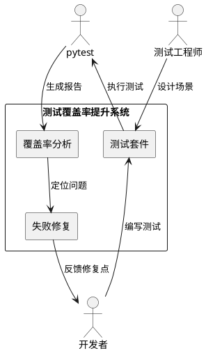
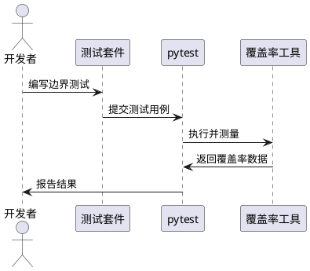
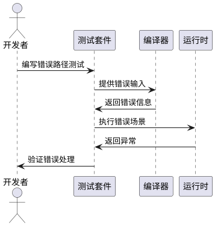
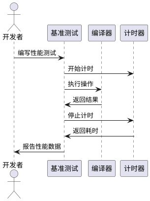
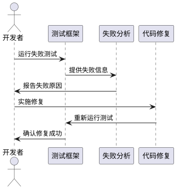

# 测试覆盖率提升需求规格

## 1. 组件定位

### 1.1 核心职责

本组件负责提升心语语言项目的测试覆盖率至80%以上，修复失败测试用例，补充边界情况和错误路径测试，确保代码质量达到生产标准。

### 1.2 核心输入

1. 现有测试套件（tests/目录下的468个测试用例）
2. 测试覆盖率报告（当前61%）
3. 失败测试列表（9个失败，2个跳过）
4. 源代码结构（src/目录下的39个Python文件）

### 1.3 核心输出

1. 新增测试用例（目标增加150+个测试）
2. 修复后的测试套件（通过率100%）
3. 提升后的覆盖率报告（≥80%）
4. 性能基准测试套件

### 1.4 职责边界

本组件不负责：
- 修改编译器核心逻辑（除非发现bug）
- 重构现有代码结构
- 添加新功能特性
- 优化性能（仅添加性能测试）

## 2. 领域术语

**测试覆盖率**
: 代码被测试用例执行到的比例，衡量测试完整性的指标。
: 备注：包括语句覆盖率、分支覆盖率、函数覆盖率。

**边界情况测试**
: 针对输入边界值、极端情况、临界条件的测试用例。
: 备注：如空值、最大值、最小值、特殊字符等。

**错误路径测试**
: 验证系统在异常输入、错误条件下的处理行为的测试。
: 备注：确保错误被正确捕获和处理，不会导致崩溃。

**性能基准测试**
: 测量系统关键操作执行时间和资源消耗的测试。
: 备注：用于检测性能回归，建立性能基线。

## 3. 角色与边界

### 3.1 核心角色

开发者：编写和执行测试用例，修复测试失败问题
测试工程师：设计测试场景，分析覆盖率报告

### 3.2 外部系统

pytest：Python测试框架，执行测试并生成报告
pytest-cov：覆盖率测量工具，生成覆盖率数据
coverage.py：底层覆盖率收集库

### 3.3 交互上下文

## 4. DFX约束

### 4.1 性能

- 单个测试用例执行时间不超过5秒
- 完整测试套件执行时间不超过120秒
- 覆盖率测量不影响测试执行的正确性

### 4.2 可靠性

- 测试结果必须可重复，相同代码多次运行结果一致
- 测试用例相互独立，无执行顺序依赖
- 失败测试必须定位到具体原因

### 4.3 可维护性

- 测试代码遵循PEP 8规范
- 每个测试用例包含清晰的文档字符串
- 使用pytest fixtures减少代码重复

### 4.4 兼容性

- 兼容Python 3.8+
- 兼容现有测试框架配置
- 不破坏现有测试用例

## 5. 核心能力

### 5.1 边界情况测试补充

#### 5.1.1 业务规则

1. **词法分析边界测试**：必须覆盖所有关键字、操作符、特殊字符的边界情况
   a. 验收条件：[输入空字符串] → [返回空token列表]
   b. 验收条件：[输入超长字符串(10000+字符)] → [正确分词不崩溃]
   c. 验收条件：[输入非法字符] → [抛出词法错误]

2. **语法分析边界测试**：必须覆盖所有AST节点类型的边界情况
   a. 验收条件：[嵌套深度超过100层] → [抛出栈溢出错误]
   b. 验收条件：[空函数体] → [生成正确的AST]
   c. 验收条件：[参数数量超过限制] → [抛出参数错误]

3. **类型推断边界测试**：必须覆盖所有数据类型的边界情况
   a. 验收条件：[类型冲突] → [抛出类型错误]
   b. 验收条件：[未定义变量] → [抛出名称错误]
   c. 验收条件：[循环依赖] → [抛出循环错误]

#### 5.1.2 交互流程

#### 5.1.3 异常场景

1. **测试执行超时**
   a. 触发条件：[测试用例执行超过5秒]
   b. 系统行为：[标记为超时失败]
   c. 用户感知：[超时错误提示]

2. **内存不足**
   a. 触发条件：[测试消耗内存超过1GB]
   b. 系统行为：[终止测试并报告]
   c. 用户感知：[内存不足错误]

### 5.2 错误路径测试补充

#### 5.2.1 业务规则

1. **编译错误路径**：必须覆盖所有编译阶段的错误处理
   a. 验收条件：[词法错误] → [返回错误位置和提示]
   b. 验收条件：[语法错误] → [返回错误位置和提示]
   c. 验收条件：[语义错误] → [返回错误位置和提示]

2. **运行时错误路径**：必须覆盖所有运行时异常情况
   a. 验收条件：[除零错误] → [捕获并提示]
   b. 验收条件：[索引越界] → [捕获并提示]
   c. 验收条件：[类型错误] → [捕获并提示]

3. **安全错误路径**：必须覆盖安全验证失败的情况
   a. 验收条件：[非法代码注入] → [拒绝执行]
   b. 验收条件：[权限不足] → [拒绝访问]

#### 5.2.2 交互流程

#### 5.2.3 异常场景

1. **错误未被捕获**
   a. 触发条件：[测试期望异常但未抛出]
   b. 系统行为：[标记测试失败]
   c. 用户感知：[断言失败提示]

2. **错误信息不明确**
   a. 触发条件：[错误消息缺少关键信息]
   b. 系统行为：[记录警告]
   c. 用户感知：[改进建议]

### 5.3 性能基准测试添加

#### 5.3.1 业务规则

1. **编译性能基准**：必须建立编译各阶段的性能基线
   a. 验收条件：[词法分析1000行代码] → [耗时<100ms]
   b. 验收条件：[语法分析1000行代码] → [耗时<200ms]
   c. 验收条件：[完整编译1000行代码] → [耗时<500ms]

2. **运行时性能基准**：必须建立关键操作的性能基线
   a. 验收条件：[执行循环10000次] → [耗时<1s]
   b. 验收条件：[函数调用10000次] → [耗时<500ms]
   c. 验收条件：[字符串操作10000次] → [耗时<200ms]

3. **内存使用基准**：必须建立内存消耗的上限
   a. 验收条件：[编译过程] → [内存<100MB]
   b. 验收条件：[运行简单程序] → [内存<50MB]

#### 5.3.2 交互流程

#### 5.3.3 异常场景

1. **性能回归**
   a. 触发条件：[性能低于基线20%]
   b. 系统行为：[标记为性能回归]
   c. 用户感知：[性能警告提示]

2. **基准测试不稳定**
   a. 触发条件：[多次执行结果差异>10%]
   b. 系统行为：[标记为不稳定]
   c. 用户感知：[稳定性警告]

### 5.4 失败测试修复

#### 5.4.1 业务规则

1. **失败原因定位**：必须准确定位每个失败测试的根本原因
   a. 验收条件：[分析失败日志] → [定位到具体代码行]
   b. 验收条件：[复现失败场景] → [确认失败原因]

2. **修复策略选择**：必须根据失败原因选择正确的修复策略
   a. 验收条件：[测试代码错误] → [修复测试代码]
   b. 验收条件：[产品代码bug] → [修复产品代码]
   c. 验收条件：[需求变更] → [更新测试预期]

3. **回归测试**：修复后必须确保不引入新问题
   a. 验收条件：[修复后运行全量测试] → [无新增失败]
   b. 验收条件：[覆盖率不下降] → [保持或提升覆盖率]

#### 5.4.2 交互流程

#### 5.4.3 异常场景

1. **修复引入新问题**
   a. 触发条件：[修复后其他测试失败]
   b. 系统行为：[回滚修复并报告]
   c. 用户感知：[冲突警告]

2. **无法复现失败**
   a. 触发条件：[本地运行通过但CI失败]
   b. 系统行为：[标记为环境问题]
   c. 用户感知：[环境差异提示]

## 6. 数据约束

### 6.1 测试用例

1. **测试名称**：必须以test_开头，描述性强，不超过50字符
2. **测试文档**：必须包含docstring，说明测试目的和场景
3. **测试断言**：每个测试至少包含一个断言，断言消息清晰
4. **测试隔离**：测试间无共享状态，可独立运行

### 6.2 覆盖率报告

1. **总体覆盖率**：必须≥80%，精确到小数点后一位
2. **模块覆盖率**：每个核心模块覆盖率≥70%
3. **分支覆盖率**：分支覆盖率≥75%
4. **未覆盖代码**：必须列出未覆盖的代码行和原因

### 6.3 性能基准

1. **基准数据**：必须包含平均值、最小值、最大值、标准差
2. **样本数量**：每个基准测试至少运行10次取平均
3. **环境信息**：必须记录测试环境的CPU、内存、OS信息
4. **时间精度**：时间测量精确到毫秒级
